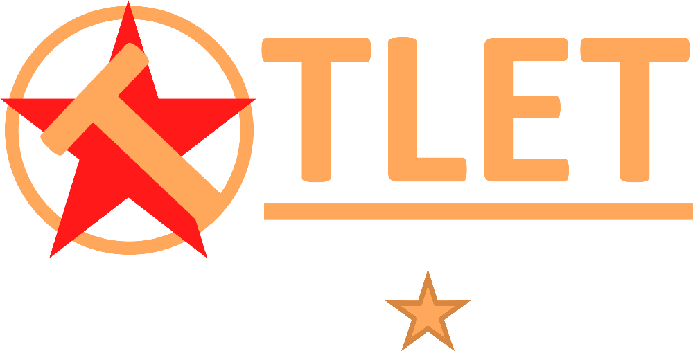

<h1 align="center">
  <picture>
    <source media="(prefers-color-scheme: dark)" srcset="./public/assets/roprotect-logo-dark.webp">
    <source media="(prefers-color-scheme: light)" srcset="./public/assets/roprotect-logo-light.webp">
    
  </picture>
  <br>
  <a href="https://github.com/ItsTato/roprotect-extension/blob/main/LICENSE">
    
  </a>
  <a href="https://github.com/ItsTato/roprotect-extension/issues">
    
  </a>
  <a href="https://discord.gg/ZwJbrWHPVz">
    
  </a>
  <br>
  <a href="https://chromewebstore.google.com/detail/rotector/ilegibonffbmecfchpcmcmknocboagan">
    
  </a>
  <a href="https://addons.mozilla.org/en-US/firefox/addon/rotector/">
    
  </a>
</h1>

<p align="center">
  <em>Real-time warnings about inappropriate Roblox users before you interact with them.</em>
</p>

> [!IMPORTANT]
> This is a **community-driven initiative** and is not affiliated with, endorsed by, or sponsored by Roblox Corporation.

## Features

RoProtect runs quietly in the background and annotates the pages you already visit:

- **Status indicators** on the home feed, friends list, friends carousels, profiles, group members, user search results, and the report page
- **Detail tooltips** with the evidence behind a flag, and one-click export of the expanded tooltip as PNG, JPG, WebP, or SVG
- **Content categories** (CSAM, Sexual, Kink, Raceplay, Condo, Other) shown alongside each status
- **Custom APIs** — point the extension at your own or a community-run backend and merge its results with the built-in data
- **API usage stats** — requests, success rate, latency, users scanned, and per-service totals for your key
- **Privacy controls** — independently blur display names, usernames, descriptions, and avatars
- **Display options** — light, dark, and system themes, plus violation translation and cipher decoding
- **24 locales**, with per-page toggles so you only scan where you want to

## Install

- **Chrome / Edge**: [Chrome Web Store](https://chromewebstore.google.com/detail/rotector/ilegibonffbmecfchpcmcmknocboagan)
- **Firefox**: [Firefox Add-ons](https://addons.mozilla.org/en-US/firefox/addon/rotector/)

## Build from Source

Requires [Bun](https://bun.sh/) v1.2+. Bun is the only supported package manager —
`bun.lock` is checked in and the lefthook hooks shell out to `bun`/`bunx`.

```bash
git clone https://github.com/ItsTato/roprotect-extension.git
cd roprotect-extension
bun install
bun run dev          # Chrome (dev:firefox, dev:edge for others)
bun run build        # Chrome (build:firefox, build:edge for others)
```

`bun install` runs `wxt prepare` and installs the lefthook git hooks, so pre-commit
formatting and typechecking are set up automatically.

### Build targets

| Target  | Command                 | Output                |
| ------- | ----------------------- | --------------------- |
| Chrome  | `bun run build`         | `.output/chrome-mv3`  |
| Edge    | `bun run build:edge`    | `.output/edge-mv3`    |
| Firefox | `bun run build:firefox` | `.output/firefox-mv2` |

Firefox builds pass `--mv2`, so the Firefox output is a **manifest v2** package. If
`WXT_USE_POLLING=1` is set, the dev server polls for changes every second — useful
on network or WSL drives where file watching misses edits.

### Load the built extension

- **Chrome / Edge**: `chrome://extensions/` or `edge://extensions/` → Enable "Developer mode" → "Load unpacked" → select `.output/chrome-mv3`
- **Firefox**: `about:debugging` → "This Firefox" → "Load Temporary Add-on" → select any file in `.output/firefox-mv2`

## Development

```bash
bun run check          # svelte-check typecheck (the only typecheck in the repo)
bun run lint           # oxlint → eslint → oxfmt --check
bun run lint:fix       # same, with autofix
bun run knip           # unused files, exports, types, and dependencies
bun run validate:i18n  # cross-locale key and placeholder consistency
bun run format:i18n    # sort keys and tab-indent the locale catalogs
bun run quality        # the pre-commit gate: check, knip, i18n, stylelint, lint:fix
```

There is no test framework. Verification is static — `check`, `knip`,
`validate:i18n`, `stylelint`, `lint`, and `build` are what CI runs, and that is what a
change is expected to pass.

### Adding support for a new Roblox page

Four places need to change together:

1. `PAGE_TYPES` in `src/lib/types/constants.ts`
2. `detectPageType` in `src/lib/utils/dom/page-detection.ts`
3. a controller factory in `PageControllerManager`
4. a Svelte `*PageManager.svelte` under `src/components/features/`

### Adding a user-facing string

Add the key to **all 24** catalogs in `public/locales/`, with matching `{0}`-style
placeholders, then run `bun run format:i18n`. `public/_locales/` is a separate
manifest catalog and must contain only `extensionName` and `extensionDescription`.

## Contributing

1. Fork the repository
2. Create a feature branch
3. Run `bun run quality` before committing
4. Submit a pull request

Commit messages follow [Conventional Commits](https://www.conventionalcommits.org/)
and are enforced by commitlint.

This project follows the [Contributor Covenant Code of Conduct](CODE_OF_CONDUCT.md).

## Support

- [GitHub Issues](https://github.com/ItsTato/roprotect-extension/issues)
- [Discord](https://discord.gg/ZwJbrWHPVz)

## License

[GNU General Public License v2.0](LICENSE)
